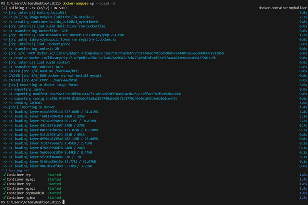
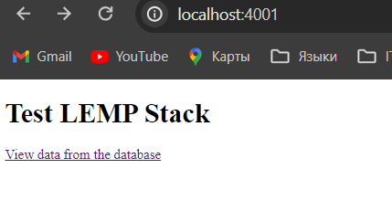
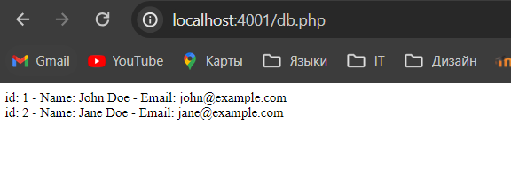
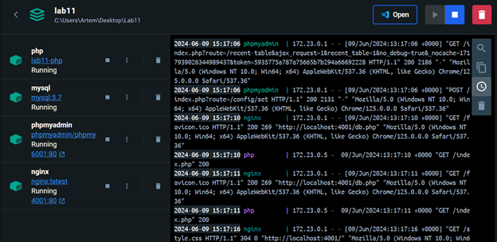
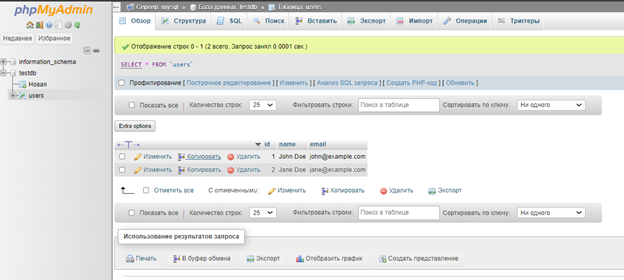

# Sprawozdanie_Lab11

# File Tree

```
project_root/
│
├── docker-compose.yml
├── init.sql
├── html/
│   ├── index.php
│   ├── db.php
│   └── style.css
│
├── images/
│   ├── img1.png
│
├── nginx.conf
└── php/
    └── Dockerfile
```

# Tworzenie pliku docker-compose.yml

```
version: '3.8'

services:
  nginx:
    image: nginx:latest
    container_name: nginx
    ports:
      - "4001:80"
    volumes:
      - ./nginx.conf:/etc/nginx/nginx.conf:ro
      - ./html:/var/www/html
    networks:
      - frontend
      - backend
    depends_on:
      - php

  php:
    build:
      context: .
      dockerfile: ./php/Dockerfile
    container_name: php
    volumes:
      - ./html:/var/www/html
    networks:
      - backend


  mysql:
    image: mysql:5.7
    container_name: mysql
    environment:
      MYSQL_ROOT_PASSWORD: rootpassword
      MYSQL_DATABASE: testdb
      MYSQL_USER: testuser
      MYSQL_PASSWORD: testpassword
    volumes:
      - mysql_data:/var/lib/mysql
      - ./init.sql:/docker-entrypoint-initdb.d/init.sql
    networks:
      - backend

  phpmyadmin:
    image: phpmyadmin/phpmyadmin:latest
    container_name: phpmyadmin
    environment:
      PMA_HOST: mysql
      PMA_USER: testuser
      PMA_PASSWORD: testpassword
    ports:
      - "6001:80"
    networks:
      - backend

networks:
  frontend:
  backend:

volumes:
  mysql_data:
```

# Tworzenie Dockerfile dla PHP

```
# Use an official PHP runtime as a parent image
FROM php:7.4-fpm

# Set the working directory
WORKDIR /var/www/html

# Install any dependencies
RUN docker-php-ext-install mysqli

# Copy the current directory contents into the container at /var/www/html
COPY . /var/www/html

# Informacje o autorze
LABEL maintainer="Maksim Rymasheuski"
```

# Uruchomienie kontenerów

```
docker-compose up --build -d
```



# Sprawdzenie statusu kontenerów

```
docker ps -a
```

```
CONTAINER ID   IMAGE                           COMMAND                  CREATED          STATUS          PORTS                  NAMES
d92fa88d71ab   nginx:latest                    "/docker-entrypoint.…"   10 minutes ago   Up 10 minutes   0.0.0.0:4001->80/tcp   nginx
5767955027ba   mysql:5.7                       "docker-entrypoint.s…"   10 minutes ago   Up 10 minutes   3306/tcp, 33060/tcp    mysql
f977f89aff01   lab11-php                       "docker-php-entrypoi…"   10 minutes ago   Up 10 minutes   9000/tcp               php
39da210811fe   phpmyadmin/phpmyadmin:latest    "/docker-entrypoint.…"   10 minutes ago   Up 10 minutes   0.0.0.0:6001->80/tcp   phpmyadmin
eb20328be6f5   moby/buildkit:buildx-stable-1   "buildkitd"              10 minutes ago   Up 10 minutes                       buildx_buildkit_mybuilder0
```

# Results






